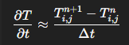
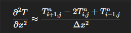
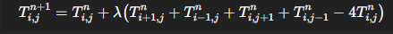
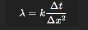

# Parallel Heat Simulation

## Video Demonstration

[View the simulation in action](https://testusjedu-my.sharepoint.com/:v:/g/personal/rodolph_khoury_net_usj_edu_lb/IQDT1FTt_VKHRrFFpnb6u5FdAQHGeqv7cVF4cx-vQFr2D0A?nav=eyJyZWZlcnJhbEluZm8iOnsicmVmZXJyYWxBcHAiOiJPbmVEcml2ZUZvckJ1c2luZXNzIiwicmVmZXJyYWxBcHBQbGF0Zm9ybSI6IldlYiIsInJlZmVycmFsTW9kZSI6InZpZXciLCJyZWZlcnJhbFZpZXciOiJNeUZpbGVzTGlua0NvcHkifX0&e=xcbZa1)

## Overview

This project solves the 2D transient heat-conduction equation using the explicit finite-difference FTCS (Forward Time Centered Space) method. The implementation is based on *Numerical Methods for Engineers* by Chapra & Canale (Chapter 30).


## The Heat Equation

The heat-conduction equation is a parabolic PDE—meaning it has a first derivative in time and second derivatives in space. This characterizes diffusion problems where heat gradually spreads through a domain over time. (PT8.1 — PDE Classification)


## Numerical Method

### Time Discretization

We use forward differences (Forward Euler) for the time derivative (Ch. 30.2):



### Space Discretization

Central differences approximate the spatial derivatives (Ch. 30.2):



### The Update Rule

Combining time and space discretization gives us the FTCS update (Eq. 30.2):



The stability coefficient is:



Which leads to the discrete update:

```cpp
unew[i][j] =
    u[i][j] + (DT / (H * H)) *
    (u[i+1][j] + u[i-1][j] +
     u[i][j+1] + u[i][j-1] - 4 * u[i][j]);
```

## Boundary Conditions

We apply Dirichlet conditions (Ch. 29.3):
- Top edge: 100°C (heat source)
- All other edges: 0°C

```cpp
if (y == LY) T = 100;
if (x == 0 || x == LX || y == 0) T = 0;
```

## Stability

For stability in 2D, the timestep must satisfy (Ch. 30.2.1):

```
Δt ≤ (Δx² * Δy²) / (2 * (Δx² + Δy²))
```

Violating this causes temperature spikes.

## Computational Stencil

The 5-point stencil for the 2D heat equation (PT8.2):

```
    (i, j+1)
(i-1,j) (i,j) (i+1,j)
    (i, j-1)
```

## Parallelization

The domain is decomposed into horizontal slices, with each process handling a portion of rows. Processes exchange boundary rows at each timestep to update ghost cells.

## Implementation Details

| Concept | Source | Implementation |
|---|---|---|
| PDE | Ch. 30.1 | Base model |
| FTCS Method | Ch. 30.2 | `heatEquation()` |
| Stability | Ch. 30.2.1 | Timestep selection |
| Boundary Conditions | Ch. 29.3 | Edge handling |
| Stencil | PT8.2 | 5-point pattern |

## Prerequisites

- C++ compiler with C++17 support
- CMake ≥ 3.16

## Build Instructions

Navigate to project root and build: 

```bash
cd parallel_computing_project
mkdir -p build && cd build
cmake ..
cmake --build .
```

The executable `heat_solver.exe` will be in the build directory.

## Run Instructions

### Single Machine

**Windows:**
```bash
export PATH="/c/Program Files/Microsoft MPI/Bin: $PATH"
mpiexec -n 4 ./heat_solver.exe
```

**Linux:**
```bash
mpiexec --oversubscribe -n 4 ./heat_solver
```

### Multiple Machines

**Prerequisites:**
```bash
sudo apt update && sudo apt install -y openmpi-bin openmpi-common libopenmpi-dev build-essential cmake git libglfw3-dev libgl1-mesa-dev
```

**Setup:**

1. **Get machine info (on each machine):**
   ```bash
   hostname -I  # IP address
   nproc        # CPU cores
   ```

2. **Configure SSH (on master):**
   ```bash
   ssh-keygen -t ed25519 -f ~/.ssh/id_ed25519 -N ""
   ssh-copy-id -i ~/.ssh/id_ed25519.pub username@worker-ip
   ssh username@worker-ip hostname  # Verify
   ```

3. **Clone and build (on ALL machines):**
   ```bash
   cd ~
   git clone https://github.com/rodolphelkhoury/parallel_computing_project.git
   cd parallel_computing_project
   mkdir build && cd build
   cmake ..  && make
   ```

4. **Create hostfile on master (`~/hosts.txt`):**
   ```
   master-hostname slots=4
   worker-1-hostname slots=4
   worker-2-hostname slots=4
   ```
   Use `nproc` output for slot count.  Use IP addresses if hostnames don't resolve.

5. **Run (from master):**
   ```bash
   cd ~/parallel_computing_project/build
   mpirun --hostfile ~/hosts.txt -np 8 ./heat_solver
   ```
   Total processes (`-np`) must not exceed total slots in hostfile. 
